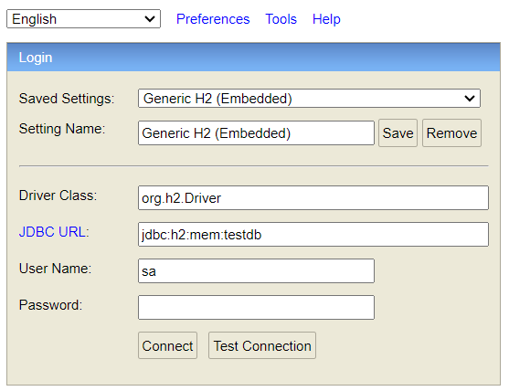

# Device Service
This **Spring Boot** project follows an organized structure adhering to the **MVC (Model View Controller)** pattern for simplicity and maintainability. Additionally, a **caching** mechanism is implemented to improve performance by storing frequently accessed data.
## Table of Contents

- [Prerequisites](#prerequisites)
- [Project Structure](#project-structure)
- [Libraries and Dependencies](#libraries-and-dependencies) 
- [Building and Running the Application](#building-and-running-the-application)
- [Setting Up the H2 Database](#setting-up-the-h2-database)
- [Running Tests](#running-tests)
- [API Endpoints](#api-endpoints)

## Prerequisites

Before running the application, ensure you have the following installed:

- **Java 17** or later
- **Maven 3.6+**
- **Git** (optional, for cloning the project)

## Project Structure
The following directories organize the project's core components:

- [📁 **application**](src/main/java/com/goksucanciftci/deviceservice): Contains the main class annotated with `@SpringBootApplication`, responsible for bootstrapping the application.
- [📁 **controller**](src/main/java/com/goksucanciftci/deviceservice/controller): Holds class annotated with `@RestController`, responsible for handling incoming HTTP requests and sending responses.
- [📁 **domain**](src/main/java/com/goksucanciftci/deviceservice/model/entity): POJOs (Plain Old Java Objects) annotated with `@Entity` that represent database tables. These classes map to the database structure.
- [📁 **dto**](src/main/java/com/goksucanciftci/deviceservice/model/dto): Data Transfer Object (DTO) class, used for transferring data between different layers of the application.
- [📁 **mapper**](src/main/java/com/goksucanciftci/deviceservice/model/mapper): Utility class that convert between `Entity` and `DTO` objects.
- [📁 **repository**](src/main/java/com/goksucanciftci/deviceservice/repository): Repository interface annotated with `@Repository`, responsible for database access, such as CRUD operations.
- [📁 **service**](src/main/java/com/goksucanciftci/deviceservice/service): Service class annotated with `@Service`, where business logic is implemented.
- [📁 **impl**](src/main/java/com/goksucanciftci/deviceservice/service/impl): Implementations of service interface containing business logic.

## Libraries and Dependencies

The following libraries and dependencies are used in this project:

- [Spring Web](https://docs.spring.io/spring-framework/docs/current/reference/html/web.html): Provides the core web and RESTful functionalities to build web applications and APIs.
- [Spring Data JPA](https://spring.io/projects/spring-data-jpa): Simplifies database access with JPA (Java Persistence API) for database-driven applications.
- [H2 Database](https://www.h2database.com/html/main.html): An in-memory database used for development and testing.
- [Spring Boot Starter Validation](https://docs.spring.io/spring-boot/docs/current/reference/htmlsingle/#boot-features-validation): Adds support for validation with annotations such as `@Valid` and `@NotNull`.
- [Spring Boot Starter Test](https://docs.spring.io/spring-boot/docs/current/reference/htmlsingle/#boot-features-testing): Provides testing support, including libraries like JUnit and Mockito.
- [Lombok](https://projectlombok.org/): A library that reduces boilerplate code by automating getter, setter, constructor generation, and more through annotations.
- [Spring Boot Starter Cache](https://docs.spring.io/spring-boot/docs/current/reference/htmlsingle/#boot-features-caching): Provides caching support to optimize performance by caching frequently accessed data.

## Building and Running the Application

Follow these steps to set up the project on your local machine:

1. **Clone the repository:**
   ```bash
   git clone https://github.com/goksucanciftci/device-service.git
2. **Navigate to the folder:**
   ```bash
   cd device-service
3. **Build the applicaiton:**
    ```bash
   mvn clean instal
   ```
   Alternatively, for Windows:
   ```bash
   build.bat
   ```
4. **Run the application:**
   ```bash
   mvn spring-boot:run
   ```
   Alternatively, for Windows:
   ```bash
   run.bat
   ```

Once the application is running, it will be available at `http://localhost:8080`.

## Setting Up the H2 Database
The project uses an **H2 in-memory database** for development and testing purposes. You can configure and access the H2 database console by following these steps.
### Configuring H2 Database

The necessary configurations for H2 are defined in the `application.properties` file, will be found under the `src/main/resources/` directory.
Here is an example of the configuration for H2:

```properties
# H2 Database settings
spring.h2.console.enabled=true
spring.datasource.url=jdbc:h2:mem:testdb
spring.datasource.driverClassName=org.h2.Driver
spring.datasource.username=sa
spring.datasource.password=password
spring.datasource.platform=h2
spring.jpa.database-platform=org.hibernate.dialect.H2Dialect
spring.jpa.hibernate.ddl-auto=update
```
### Accessing the H2 Console

To access the H2 database console and inspect your in-memory data, follow these steps:

1. Start the application.
2. Navigate to the following URL in your web browser:
   ```
   http://localhost:8080/h2-console
   ```
3. In the H2 console, use the following settings (as shown in the image):
    - **Driver Class**: `org.h2.Driver`
    - **JDBC URL**: `jdbc:h2:mem:testdb`
    - **User Name**: `sa`
    - **Password**: `password`

4. Click **Connect** to access the H2 database.


Once connected, you can run SQL queries, view tables, and manage the in-memory database as needed.

> **Note:** Since H2 is an in-memory database, all data will be lost once the application is stopped.

## Running Tests

This project includes unit tests to ensure the functionality of the various components (controller, service, repository) using **JUnit** and **Mockito**.

### To run the tests:

1. **Using Maven**:
   Run the following command to execute the tests using Maven:

   ```bash
   mvn test

## API Endpoints
The application exposes several RESTful API endpoints to manage devices. Below are the available endpoints and their corresponding HTTP methods:
### Device API

- **GET /api/v1/device**: Retrieve a list of all devices.
   - **Request**: None.
   - **Response**: List of devices.


- **GET /api/v1/device/{id}**: Retrieve a specific device by its ID.
   - **Request**: Device ID in the URL path.
   - **Response**: The device details, or 404 if the device is not found.


- **POST /api/v1/device**: Create a new device.
   - **Request**: JSON payload with device information.
   - **Response**: The newly created device with its ID.
   - **Body**:
  ````json
  {
    "name": "Device1",
    "brand": "BrandX"
  }
  ````


- **PUT /api/v1/device/{id}**: Update an existing device by its ID.
   - **Request**: Device ID in the URL path and a JSON payload with updated data.
   - **Response**: The updated device details.
   - **Body**:
  ````json
  {
    "name": "UpdatedDevice1",
    "brand": "UpdatedBrandX"
  }
  ````

- **DELETE /api/v1/device/{id}**: Delete a device by its ID.
    - **Request**: Device ID in the URL path.
    - **Response**: 202 Accepted if the deletion was successful.


- **GET /api/v1/device/brand?brand={brandName}**: Retrieve devices filtered by brand.
    - **Request**: Brand name as a query parameter. The filtering is **case-insensitive** and performs a **contains** operation, meaning any device whose brand contains the specified string (ignoring case) will be returned.
    - **Response**: List of devices that match the specified brand.